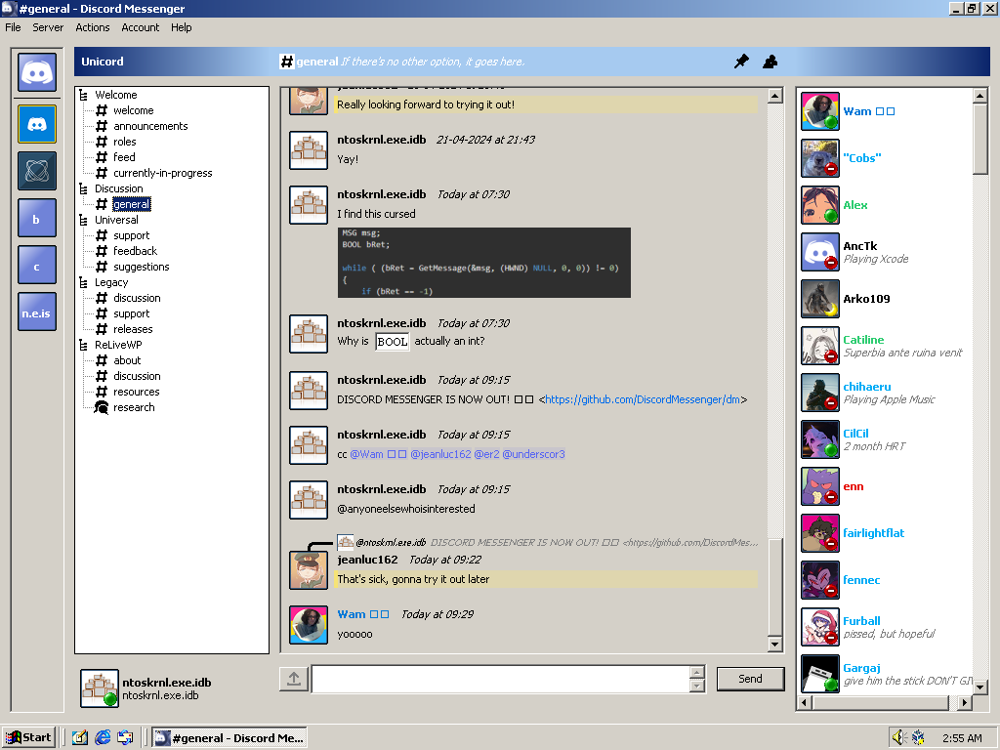
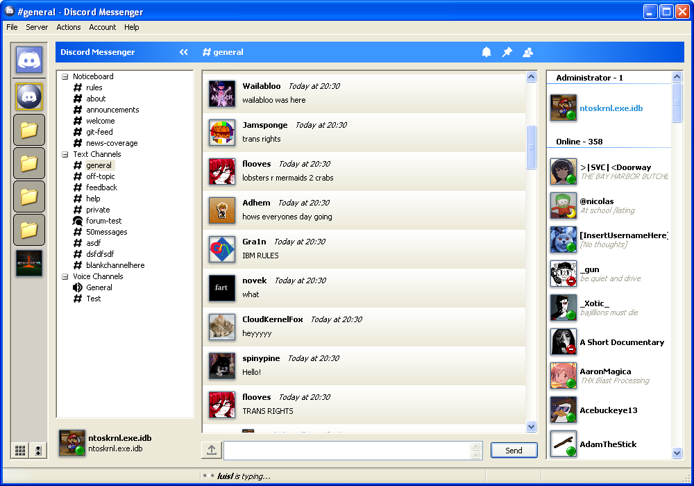

# Discord Messenger for Windows

Discord Messenger is a messenger application designed to be compatible with Discord, while being
backwards compatible with down to Windows 2000 (although support for even older versions has been
attempted).

Its motto: *It's time to ditch MSN and Yahoo.*

**NOTE**: This is beta software, so there may be issues which need to be fixed!

The project is licensed under the MIT license.

## Disclaimer

Using third party clients is against Discord's TOS! Although the risk to get banned is low, the
risk is there! The author of this software is not responsible for the status of your Discord
account.

See https://twitter.com/discord/status/1229357198918197248.

## Screenshots

## Minimum System Requirements

- Windows 2000 or newer (MinGW version)

- Windows XP SP2 or newer (MSVC version)

- Pentium 4 CPU (compile OpenSSL without SSE instructions if you want to target older CPUs)

- 64 MB of RAM

## Building

You can build this project in two ways.

### 1. Visual Studio

This method can only support down to Windows XP SP2, but it's easier to get started with.

1. Compile OpenSSL for Win32, or find a distribution of OpenSSL 3.X which also declares the
APIs deprecated in OpenSSL 3.X.

If you want to have a quick attempt, you can use the following distribution:
https://web.archive.org/web/20211215214922/https://slproweb.com/download/Win32OpenSSL-3_0_1.exe

However, please note that this version may have security vulnerabilities that freshly made
OpenSSL distributions don't have.

I'll soon look for alternatives to OpenSSL.Install OpenSSL for Win32. You can acquire it from the following website:

2. Add an entry to your user/system environment variables called `OPENSSL_INSTALL`.  Set its value
to the place where your OpenSSL distribution is located.

3. If you want to use a later version of libwebp, acquire libwebp from the following web site:
https://developers.google.com/speed/webp/download.  Extract the archive and place "libwebp.lib" in
`vs/libs`.

4. Open the Visual Studio solution `vs\DiscordMessenger.sln`.

5. Switch to the `x86` profile, and build.  `x64` build is currently not supported.

6. Enjoy!

### 2. MinGW

1. Acquire MinGW-6.3.0.  This is the last version of the original Minimalist GNU for Windows.

NOTE: You might be able to use Mingw-w64, but you might run into trouble running the final product
on anything newer than XP.

2. Using the MinGW Installation Manager, install or ensure that the following packages are installed:
	- mingw32-base
	- mingw32-binutils
	- mingw32-gcc
	- mingw32-gcc-core-deps
	- mingw32-gcc-g++
	- mingw32-libatomic
	- mingw32-libgcc
	- mingw32-w32api
	- msys-base
	- msys-bash
	- msys-core
	- msys-make

3. Ensure that both the MinGW `bin/` AND msys `bin/` directories are in your `PATH`.

4. Set `OPENSSL_INC_DIR` and `OPENSSL_LIB_DIR` in your environment variables to your OpenSSL
include and library directories.  If you want to remember the paths, edit the Makefile to use those
as your defaults (but make sure to not check in your change when sending a PR!)

If you wish to use Shining Light Productions' distribution of OpenSSL-Win32, use the
`%OPENSSL_INSTALL%/include` and `%OPENSSL_INSTALL%/lib/MinGW` directories for the include and lib
dirs respectively.

If you want compatibility on Windows versions which don't support the Microsoft Visual Studio 2015
runtimes (VCRUNTIME140.DLL), then you will need to compile OpenSSL yourself.  See the section on
[Compiling OpenSSL for older Windows versions](#compiling-openssl-for-older-windows-versions)
section.

5. Run the `make` command.

6. Enjoy!

## Features
### Implemented

- Viewing and interacting with servers and direct messages
- Viewing and downloading images and attachments
- Uploading attachments
- Editing messages
- Deleting messages
- Replying to messages
- Typing indicator
- URL hotlinks with untrusted link warning dialog (1)
- Viewing member list in servers (2)
- Viewing pinned messages in server
- Embeds (6)

### Unimplemented but planned

- Friends list
- Showing profile pictures in DM list
- Viewing member list in group messages and DMs
- Dark mode on modern systems (3)
- Using an asynchronous HTTP library (4)
- Entering voice channels (5)
- Blocking, closing DMs, removing as friend
- Muting channels
- Changing nickname
- More options in the "Preferences" menu
- Assigning a custom status
- User notes

### Unplanned Features

- Sending friend requests
- Creating DM channels
- Logging in using QR code (7) (8)
- Logging in using e-mail address and password (7)
- Entering servers (7)

### Note
1. You may need a modern browser to actually access most links.

2. Only the first 100 users. I plan on changing it.

3. Would take a lot of effort, but theoretically it is possible. No, it's not as simple as hooking
   certain APIs.

4. Currently, we are using a synchronous HTTP library, with threads to simulate async behavior.

5. Planned for far in the future.

6. Embeds are incomplete, for example, fields don't function properly.

7. Action is weighted by Discord's anti-spam measures. It could cause the target to get autobanned.

8. Some code already exists, but this feature is unfinished and will probably never be finished.

## Compiling OpenSSL for older Windows versions

[TODO: Figure out ways to disable usage of certain newer instruction sets such as SSE2]

You will need to use the later MinGW forks (not the original one as this project wants).
Start by opening `mingw32`, then cloning the OpenSSL repo. (found at the following links:
git://git.openssl.org/openssl.git and https://github.com/openssl/openssl.git )

Then, install nasm with the command `pacman -S nasm`.

Once cloned, run the command `perl Configure mingw`.

[TODO: Figure out how to avoid this]
Once that's done, open the Makefile, find `CNF_CPPFLAGS`, and add the following flags:
`-DWINVER=0x0501 -D_WIN32_WINNT=0x0501 -DOPENSSL_THREADS -DOPENSSL_NO_ASYNC -DOPENSSL_USE_NODELETE`.
[NOTE: I know it says not to edit, but I haven't actually figured out a good way to make
 the perl configuration script do that for me]

After that, run `make`.  This should place *.a and *.dll files in the root of the project

To use them when compiling Discord Messenger, use [OpenSSL repo root]/include as your
OPENSSL_INC_DIR, and [OpenSSL repo root] as your OPENSSL_LIB_DIR.

[TODO: Figure out how to avoid this]
[TODO: Maybe remove all scanf uses?]
NOTE: On Windows 2000 and earlier, OpenSSL can't link because it uses `_strtoi64` and
`_strtoui64`. Replace these imports with functions likely to return 0 such as `iswxdigit`
and `isleadbyte` respectively, using a hex editor.

## Attributions

Discord Messenger is powered by the following external libraries:

- [JSON for Modern C++](https://github.com/nlohmann/json)
- [Boost](https://www.boost.org)
- [Libwebp](https://github.com/webmproject/libwebp)
- [Httplib](https://github.com/yhirose/cpp-httplib)
- [Asio](https://think-async.com/Asio)
- [Websocketpp](https://github.com/zaphoyd/websocketpp)

Although these libraries are vendored, you can replace them with the latest version, and the MSVC
build will keep working.  Adjustments were made to certain libraries to make them compile on MinGW.
See `doc/` for details.
